# PySide6 Neumorphism Widget Library

A **distributable, feature-rich PySide6 widget library** with a soft Neumorphism visual style, inspired by [Neumorphism.Avalonia](https://github.com/flarive/Neumorphism.Avalonia). Includes a live interactive showcase app covering every widget.

> **Requirements:** Python 3.11+ · PySide6 ≥ 6.6 · qtawesome ≥ 1.3


---

## ✨ Highlights

| Area | What's included |
|---|---|
| **Shadow engine** | `BoxShadow` — multi-layer inset/outset shadows on any Qt widget |
| **Theme system** | Light/Dark runtime toggle · 5 accent presets · `set_accent()` API · focus indicators |
| **New widgets** | `ToggleSwitch` · `CollapsibleSection` · `Snackbar` · `AnimatedCard` · `RippleButton` |
| **QSS snippets** | `qss` module — palette-aware factory functions for labels, cards, buttons, dialogs, calendar |
| **Showcase** | 16 interactive demo pages auto-discovered from `widgets/catalog/` |
| **Packaging** | `pyproject.toml` (Hatch) — installable as `neumorphism-pyside6` |

---

## 🚀 Quickstart

```bash
git clone https://github.com/tolgayilmaz86/Neumoython.git
cd Neumoython
python -m venv .venv && .venv\Scripts\activate
pip install -r requirements.txt
python src/app/main.py
```

> The app **must be launched from the repo root** (`python src/app/main.py`) or from `src/app/` (`python main.py`).

---

## 📸 Showcase Screenshots

| Page | Screenshot |
|---|---|
| **Buttons** | 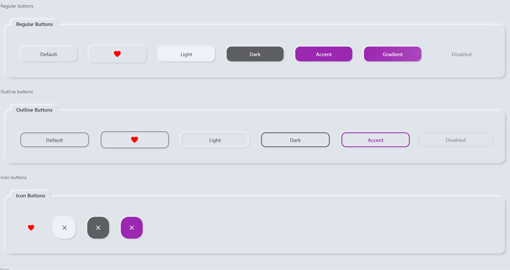 |
| **Toggles** | 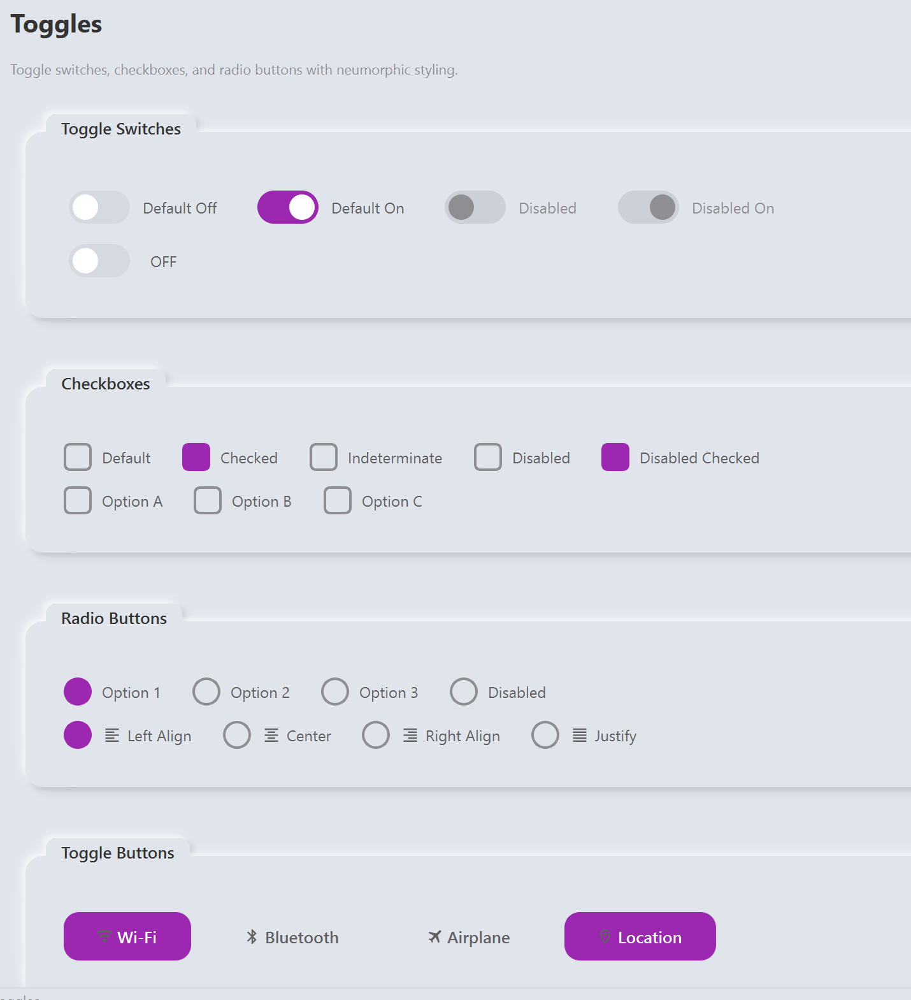 |
| **Inputs** |  |
| **Sliders** | 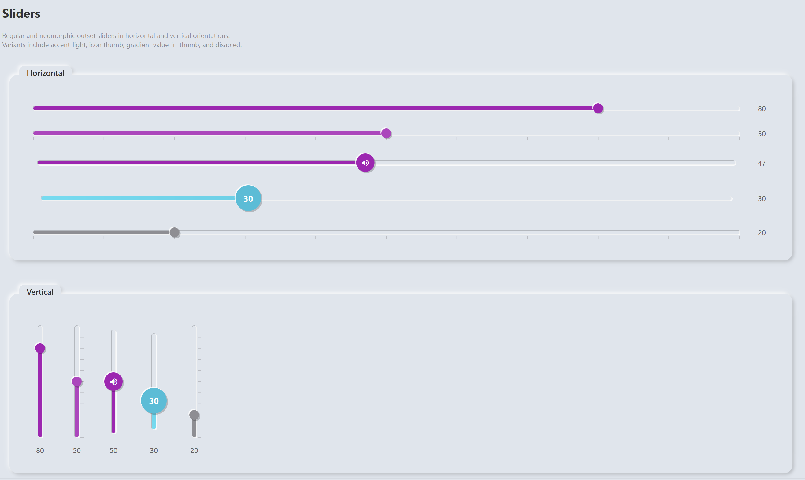 |
| **Progress Bars** | 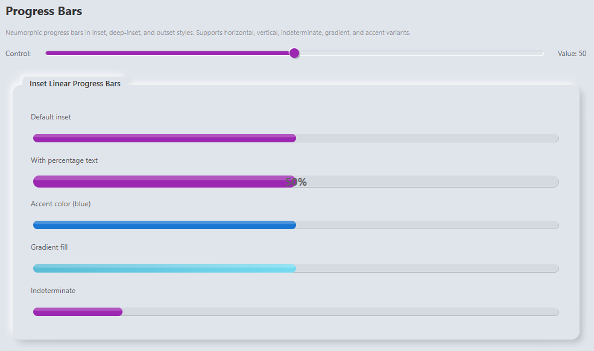 |
| **Cards** | 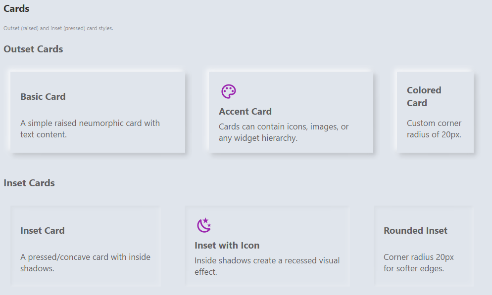 |
| **Lists** | 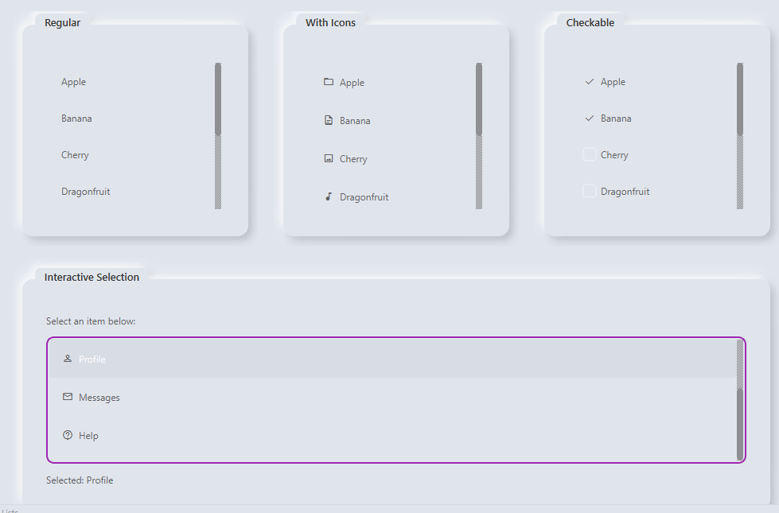 |
| **Tabs** | 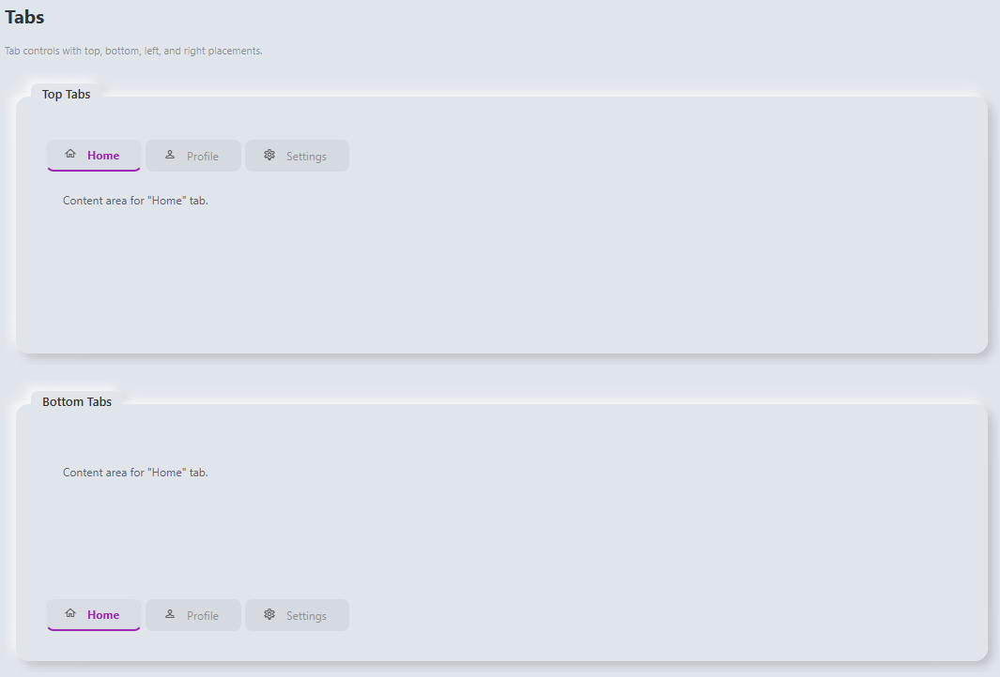 |
| **Expanders** | 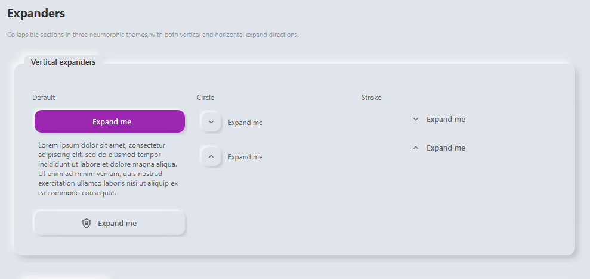 |
| **Icons** | 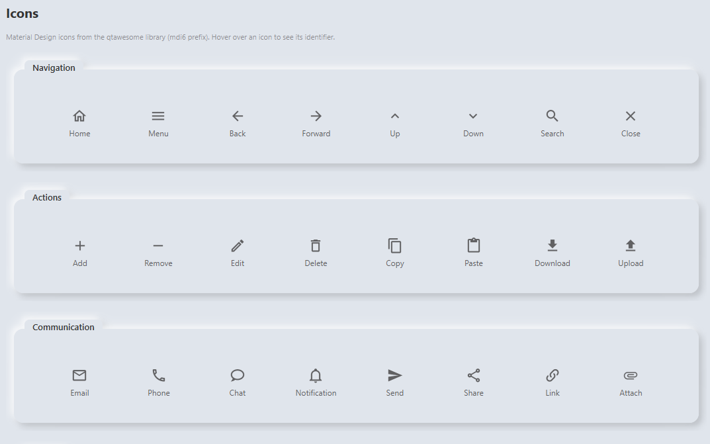 |
| **Snackbars** | 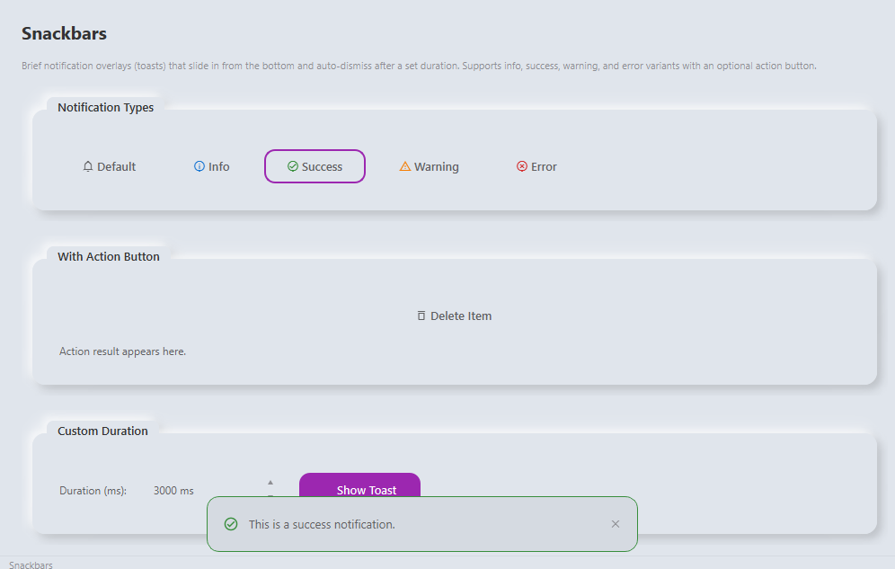 |
| **Fields** |  |
| **Date & Time** | 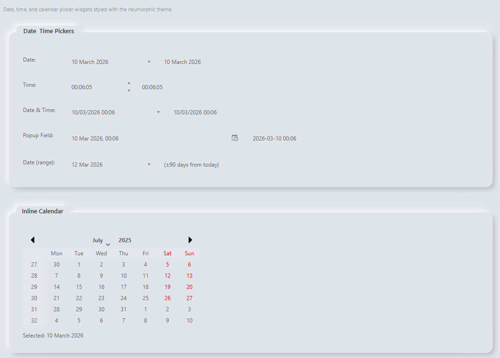 |
| **Combo Boxes** |  |
| **Dialogs** |  |
| **Menus** | 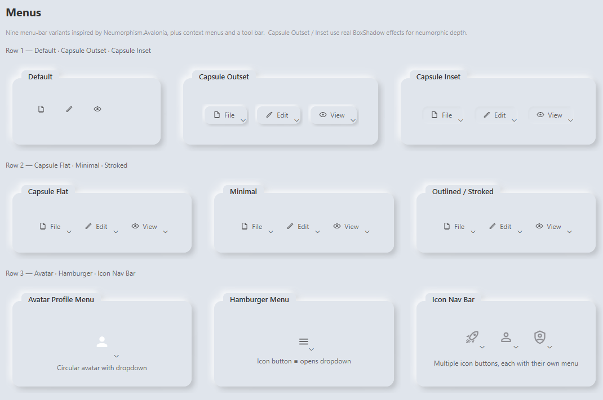 |

| Theme | Screenshot |
|---|---|
| **Light mode** |  |
| **Dark mode** |  |
| **Accent colours** | 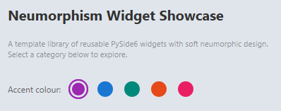 |

---

## 🎛️ Widget Catalog

### Core / Layout

| Widget | Module | Description |
|---|---|---|
| `BoxShadow` | `widgets.box_shadow` | `QGraphicsEffect` — multi-layer inset & outset shadows |
| `BoxShadowWrapper` | `widgets.box_shadow` | Convenience wrapper that adds shadow margins automatically |
| `AnimatedCard` | `widgets.animated_card` | Neumorphic card that smoothly elevates on hover via `QPropertyAnimation` |

### Controls

| Widget | Module | Description |
|---|---|---|
| `ToggleSwitch` | `widgets.toggle_switch` | Animated pill toggle — keyboard accessible (Space/Return), emits `toggled(bool)` |
| `RippleButton` | `widgets.ripple_button` | `QPushButton` drop-in with Material ink-ripple on click |
| `CollapsibleSection` | `widgets.collapsible_section` | Animated accordion expander with `addContent()` API |
| `PopupDateTimeField` | `widgets.popup_datetime_field` | Read-only field with popup calendar + time picker |

### Notifications

| Widget | Module | Description |
|---|---|---|
| `Snackbar` | `widgets.snackbar` | Overlay toast — 5 types · action button · auto-dismiss · slide animation |

### Progress

| Widget | Module | Description |
|---|---|---|
| `roundProgressBar` | `widgets.progress_widgets` | Animated circular progress bar |
| `spiralProgressBar` | `widgets.progress_widgets` | Spiral variant |
| `NeuProgressBar` | `widgets.progress_widgets` | Neumorphic linear progress bar (raised) |
| `NeuProgressBarOutset` | `widgets.progress_widgets` | Neumorphic linear progress bar (outset shadow) |
| `NeuProgressBarDeepInset` | `widgets.progress_widgets` | Neumorphic linear progress bar (deep inset shadow) |

---

## 🛠️ Integration Guide — Using in Your Own Project

This section walks you through using the theme system and widgets in a **separate** PySide6 project.

### Step 0 — Install

Copy or install the library. The simplest approach during development:

```bash
# From the Neumoython repo root
pip install -e .
```

Or copy `src/app/styles/` and `src/app/widgets/` into your project and make sure `qtawesome>=1.3` and `PySide6>=6.6` are in your requirements.

### Step 1 — Apply the Theme

The theme manager is a singleton. Call `apply()` **once** after creating `QApplication`:

```python
import sys
from PySide6.QtWidgets import QApplication
from styles.theme_manager import theme_manager

app = QApplication(sys.argv)

# Apply full neumorphic QSS — must be called before showing any window
theme_manager.apply(app)

# Optionally start in dark mode (default is dark)
theme_manager.set_theme("dark")   # or "light"
```

### Step 2 — Change the Accent Colour

Five built-in presets, or pass any hex colour:

```python
from styles.theme_manager import (
    theme_manager,
    ACCENT_PURPLE,   # #9C27B0  (default)
    ACCENT_BLUE,     # #1976D2
    ACCENT_TEAL,     # #00897B
    ACCENT_CORAL,    # #E64A19
    ACCENT_PINK,     # #E91E63
)

theme_manager.set_accent(ACCENT_BLUE)
theme_manager.apply()               # re-applies QSS with new accent

theme_manager.set_accent("#FF5722") # any hex value works
theme_manager.apply()
```

### Step 3 — Toggle Light / Dark at Runtime

```python
theme_manager.toggle()  # switches and re-applies automatically
```

### Step 4 — Read the Live Palette

Every colour used across the QSS is exposed in a dict:

```python
pal = theme_manager.palette   # dict[str, str]
```

**Available palette keys:**

| Category | Keys |
|---|---|
| Backgrounds | `bg`, `bg_secondary`, `sidebar`, `topbar`, `card_bg`, `input_bg`, `button_light`, `button_dark` |
| Text | `text`, `text_heading`, `text_muted` |
| Accent | `accent`, `accent_hover`, `accent_secondary` |
| UI chrome | `menu_active`, `menu_hover`, `border` |
| Shadows | `shadow_dark`, `shadow_light` (RGBA strings) |

Use these to keep your custom painting in sync with the active theme:

```python
from PySide6.QtGui import QColor

pal = theme_manager.palette
bg_color = QColor(pal['bg'])
accent   = QColor(pal['accent'])
```

### Step 5 — Add Neumorphic Shadows

Wrap any widget with `BoxShadowWrapper` to give it soft neumorphic shadows:

```python
from widgets.box_shadow import BoxShadowWrapper
from styles.theme_manager import theme_manager

shadows = theme_manager.shadow_configs()

# Raised card look
card_wrapper = BoxShadowWrapper(
    my_widget,
    shadow_list=shadows["outside_raised"],
    smooth=True,
    margins=(14, 14, 14, 14),
)
layout.addWidget(card_wrapper)
```

**Shadow presets:**

| Preset | Effect |
|---|---|
| `outside_raised` | Outer shadows — classic raised neumorphic card |
| `inside_pressed` | Inner shadows — pressed-in / concave look |
| `button_raised` | Lighter outer shadows sized for buttons |
| `button_pressed` | Inner shadows sized for pressed button state |
| `input_inset` | Subtle inner shadow for text fields |

### Step 6 — Use QSS Snippet Helpers

The `qss` module provides palette-aware stylesheet factory functions so you never hard-code colours:

```python
from styles import qss

# Labels
my_label.setStyleSheet(qss.transparent_label("text_muted", 14, 600))
heading.setStyleSheet(qss.section_heading())
value.setStyleSheet(qss.value_label())

# Cards & containers
frame.setStyleSheet(qss.card_frame(16))         # border-radius 16
circle.setStyleSheet(qss.icon_circle(40, "accent"))

# Buttons
close_btn.setStyleSheet(qss.close_button())
color_btn.setStyleSheet(qss.outline_color_button("#E91E63"))

# Dialogs
title.setStyleSheet(qss.dialog_title())
msg.setStyleSheet(qss.dialog_message())
primary.setStyleSheet(qss.dialog_accent_button())
secondary.setStyleSheet(qss.dialog_secondary_button())

# Calendar
cal.setStyleSheet(qss.calendar_qss())

# Expanders / collapsible sections
btn.setStyleSheet(qss.collapsible_toggle())
```

All functions resolve colours from the **active** palette at call time, so they update correctly after `toggle()` or `set_accent()`.

### Step 7 — Use Widgets

```python
# Directly importable (no QApplication needed at import time)
from widgets import (
    BoxShadow, BoxShadowWrapper,
    ToggleSwitch,
    CollapsibleSection,
    PopupDateTimeField,
    roundProgressBar, spiralProgressBar,
    NeuProgressBar, NeuProgressBarOutset, NeuProgressBarDeepInset,
)

# Lazy imports — need QApplication to exist before constructing
from widgets.snackbar import Snackbar
from widgets.ripple_button import RippleButton
from widgets.animated_card import AnimatedCard
```

#### ToggleSwitch

```python
switch = ToggleSwitch(checked=True, label="Enable Feature")
switch.toggled.connect(lambda on: print("on:", on))
layout.addWidget(switch)
```

#### RippleButton

```python
btn = RippleButton("Save")
btn.setProperty("accentButton", True)  # applies accent colour
btn.clicked.connect(save_handler)
layout.addWidget(btn)
```

#### Snackbar

```python
# Simple notification
Snackbar.show(parent_widget, "File saved", snack_type="success")

# With action button
Snackbar.show(
    parent_widget,
    "Item deleted",
    action_label="Undo",
    on_action=undo_fn,
    snack_type="warning",
)
```

Supported `snack_type` values: `"default"`, `"info"`, `"success"`, `"warning"`, `"error"`.

#### AnimatedCard

```python
card = AnimatedCard()
vbox = QVBoxLayout(card.content)
vbox.addWidget(QLabel("Hover me — shadow deepens"))
layout.addWidget(card)
```

#### CollapsibleSection

```python
section = CollapsibleSection(
    title="Advanced Options",
    icon_name="mdi6.cog-outline",
    expanded=False,
)
section.addContent(my_form_widget)
layout.addWidget(section)
```

#### Progress Bars

```python
# Circular
ring = roundProgressBar()
ring.setValue(75)

# Spiral
spiral = spiralProgressBar()
spiral.setValue(50)

# Linear neumorphic
bar = NeuProgressBar()
bar.setValue(60)
```

### Step 8 — Minimal Complete Example

```python
import sys
from PySide6.QtWidgets import QApplication, QWidget, QVBoxLayout, QLabel
from styles.theme_manager import theme_manager, ACCENT_TEAL
from styles import qss
from widgets import ToggleSwitch, BoxShadowWrapper, CollapsibleSection
from widgets.ripple_button import RippleButton

app = QApplication(sys.argv)

# 1. Apply neumorphic theme
theme_manager.set_accent(ACCENT_TEAL)
theme_manager.apply(app)

# 2. Build UI
window = QWidget()
window.setWindowTitle("My Neumorphic App")
window.resize(400, 300)
root = QVBoxLayout(window)

# Themed label
title = QLabel("Hello Neumorphism")
title.setStyleSheet(qss.section_heading())
root.addWidget(title)

# Toggle switch
switch = ToggleSwitch(label="Dark Mode")
switch.toggled.connect(lambda on: (
    theme_manager.set_theme("dark" if on else "light"),
    theme_manager.apply(),
))
root.addWidget(switch)

# Neumorphic raised card
card = QLabel("I'm a raised card")
card.setStyleSheet(qss.card_frame(12))
shadows = theme_manager.shadow_configs()
root.addWidget(BoxShadowWrapper(
    card, shadow_list=shadows["outside_raised"],
    smooth=True, margins=(12, 12, 12, 12),
))

# Ripple button
btn = RippleButton("Click Me")
btn.setProperty("accentButton", True)
root.addWidget(btn)

root.addStretch()
window.show()
sys.exit(app.exec())
```

---

## 🖥️ Demo Pages

All 16 pages live in `src/app/widgets/catalog/` and are auto-discovered at startup.

| ID | Page | Covers |
|---|---|---|
| `buttons` | Buttons | Raised, accent, flat, disabled, checked states |
| `toggles` | Toggles | `ToggleSwitch`, checkboxes, radio buttons |
| `inputs` | Inputs | `QLineEdit`, `QTextEdit`, `QSpinBox` |
| `sliders` | Sliders | Horizontal, vertical, neumorphic inset & outset variants |
| `progress_bars` | Progress | Circular, spiral, linear neumorphic `NeuProgressBar` variants |
| `cards` | Cards | Raised, inset, nested shadow layers |
| `lists` | Lists | `QListWidget` with selection states |
| `tabs` | Tabs | All four `QTabWidget` orientations |
| `expanders` | Expanders | `CollapsibleSection`, `QToolBox` |
| `icons` | Icons | Material Design 6 icon browser |
| `snackbars` | Snackbars | Default / info / success / warning / error toasts |
| `fields` | Fields | `FloatingLabelField` — animated label, validation, password reveal |
| `datetime` | Date & Time | `QDateEdit`, `QTimeEdit`, neumorphic `QCalendarWidget` |
| `comboboxes` | Combo Boxes | Icon combos, grouped headers, editable, size variants |
| `dialogs` | Dialogs | `NeuDialog` — info/confirm/login/input factory methods |
| `menus` | Menus | `QMenuBar`, context menu, `QToolBar` |

---

## ➕ Adding a New Demo Page

1. Create `src/app/widgets/catalog/my_widget_demo.py`
2. Register it at module level:
   ```python
   from widgets.registry import registry, WidgetDemo

   def create_page():
       ...
       return page_widget

   registry.register(WidgetDemo(
       id="my_widget",
       name="My Widget",
       description="Short description shown on the home card",
       create_page=create_page,
   ))
   ```
3. Add an icon entry to `_ICON_MAP` in `windows/showcase.py`.
4. Restart — the page appears in the sidebar automatically.

---

## 🗺️ Roadmap & TODO

### Current Status

The table below tracks themed control parity with [Neumorphism.Avalonia](https://github.com/flarive/Neumorphism.Avalonia) and beyond.

| Control | Avalonia | Neumoython | Notes |
|---|:---:|:---:|---|
| Buttons | ✅ | ✅ | Raised, flat, outline, icon, FAB |
| Toggle Buttons | ✅ | ✅ | `ToggleSwitch` custom widget |
| Radio Buttons | ✅ | ✅ | Themed via QSS |
| Checkboxes | ✅ | ✅ | Themed via QSS |
| Text Boxes | ✅ | ✅ | `QLineEdit`, `QTextEdit`, `FloatingLabelField` |
| Combo Boxes | ✅ | ✅ | Icon delegates, grouped sections, editable |
| Progress Bars | ✅ | ✅ | Circular, spiral, 3 linear neumorphic variants |
| Sliders | ✅ | ✅ | Horizontal, vertical, inset/outset, icon & value thumbs |
| Cards | ✅ | ✅ | Outset, inset, animated hover elevation |
| List Boxes | ✅ | ✅ | Themed `QListWidget` |
| Tabs | ✅ | ✅ | All 4 orientations |
| Date/Time Pickers | ✅ | ✅ | Calendar, time picker, popup field |
| Menus | ✅ | ✅ | Menu bar, context menus, toolbar |
| Dialogs | ✅ | ✅ | Info, confirm, login, input, success, error, warning |
| Expanders | ✅ | ✅ | 3 themes, horizontal & vertical |
| Drawings / Icons | ✅ | ✅ | MDI6 icon browser |
| Tree View | — | ❌ | Not yet themed |
| Table / Data Grid | — | ❌ | Not yet themed |
| Tooltips | — | ❌ | Still using system default |
| Use-case Samples | ✅ | ❌ | Login, audio player, profile cards, etc. |
| Tab Focus Adorner | ✅ | ⚠️ | Partial — not all custom widgets |

---

### Milestone 1 — Stability & Quality (v0.2)

- [ ] **Test suite** — Add `tests/` with `pytest` + `pytest-qt`; target ≥ 80 % line coverage
- [ ] **CI test step** — Run tests and report coverage in GitHub Actions (currently build-only)
- [ ] **Cross-platform CI** — Add Linux and macOS runners alongside Windows
- [ ] **Fix `requirements.txt`** — Add missing `qtawesome>=1.3`
- [ ] **Linting & type-checking** — Add `mypy`, `ruff` or `flake8` to CI; add `pre-commit` config
- [ ] **CHANGELOG.md** — Start tracking releases

### Milestone 2 — Theme Completeness (v0.3)

- [ ] **QTreeView / QTreeWidget** — Full neumorphic styling (indent lines, branch arrows, selection)
- [ ] **QTableView / QTableWidget + QHeaderView** — Themed cells, headers, alternating rows
- [ ] **QToolTip** — Styled tooltips matching the neumorphic palette
- [ ] **QStatusBar** — Themed status bar
- [ ] **QSplitter** — Styled splitter handles
- [ ] **QPlainTextEdit** — Ensure same treatment as `QTextEdit`
- [ ] **QDockWidget** — Title bar, undocked window styling
- [ ] **Disabled-state audit** — Verify every widget type looks correct when disabled

### Milestone 3 — New Widgets (v0.4)

- [ ] **SearchField** — Line edit with embedded search icon and clear button
- [ ] **Rating widget** — Star / score input (hover highlight, half-star support)
- [ ] **Badge / Chip** — Tag labels — closable, selectable, coloured variants
- [ ] **Avatar** — Circular image with fallback initials, size variants
- [ ] **Stepper / Step indicator** — Horizontal or vertical step tracker for wizards
- [ ] **Color picker** — Neumorphic colour wheel / palette selector
- [ ] **Breadcrumb** — Clickable path navigation

### Milestone 4 — Use-case Samples (v0.5)

Inspired by [Neumorphism.Avalonia use cases](https://github.com/flarive/Neumorphism.Avalonia):

- [ ] **Login card** — Username, password, "Remember me" toggle, accent submit button
- [ ] **Audio player** — Album art card, progress slider, play/pause ripple buttons
- [ ] **User profile** — Avatar, stats row, action buttons
- [ ] **Stopwatch** — Circular progress ring, lap list, start/stop/reset controls
- [ ] **Messaging** — Chat bubbles, input field, send button
- [ ] **Sleep quality** — Circular score, stats, date navigation
- [ ] **Dashboard** — Mixed cards with progress bars, charts placeholder, KPIs

### Milestone 5 — Polish & Distribution (v1.0)

- [ ] **PyPI publishing** — Automated `twine upload` in CI on tagged releases
- [ ] **API reference docs** — Auto-generated from docstrings (`pdoc` or Sphinx) into `docs/`
- [ ] **Contributing guide** — `CONTRIBUTING.md` with style rules, PR process, local setup
- [ ] **Accessibility audit** — Verify WCAG AA contrast ratios; test keyboard nav for all custom widgets; screen-reader labels
- [ ] **High-DPI test matrix** — Verify rendering at 100 %, 125 %, 150 %, 200 % scale
- [ ] **Performance benchmarks** — Measure shadow-painting cost; profile showcase startup time
- [ ] **Page transitions** — Add slide / morph / scale transitions between demo pages (currently fade-only)
- [ ] **Micro-interactions** — Button press depth, focus glow animation, hover tint on list items
- [ ] **Theme export/import** — Save custom palettes as JSON; load user-created themes at runtime

### Backlog / Ideas

- [ ] Custom accent colour picker in the showcase sidebar (not just 5 presets)
- [ ] QSS live editor panel — edit stylesheet in-app and see changes instantly
- [ ] Dark/light transition animation (cross-fade between palettes)
- [ ] Neumorphic `QWizard` page styling
- [ ] `QSystemTrayIcon` with themed context menu
- [ ] Animated placeholder / skeleton loading cards
- [ ] RTL (right-to-left) layout support verification
- [ ] Localization / i18n example

---

## 🎨 Credits

* **Neumorphism design:** Inspired by [Neumorphism.Avalonia](https://github.com/flarive/Neumorphism.Avalonia) by flarive.
* **Material icons:** [qtawesome](https://github.com/spyder-ide/qtawesome) by Spyder IDE.

